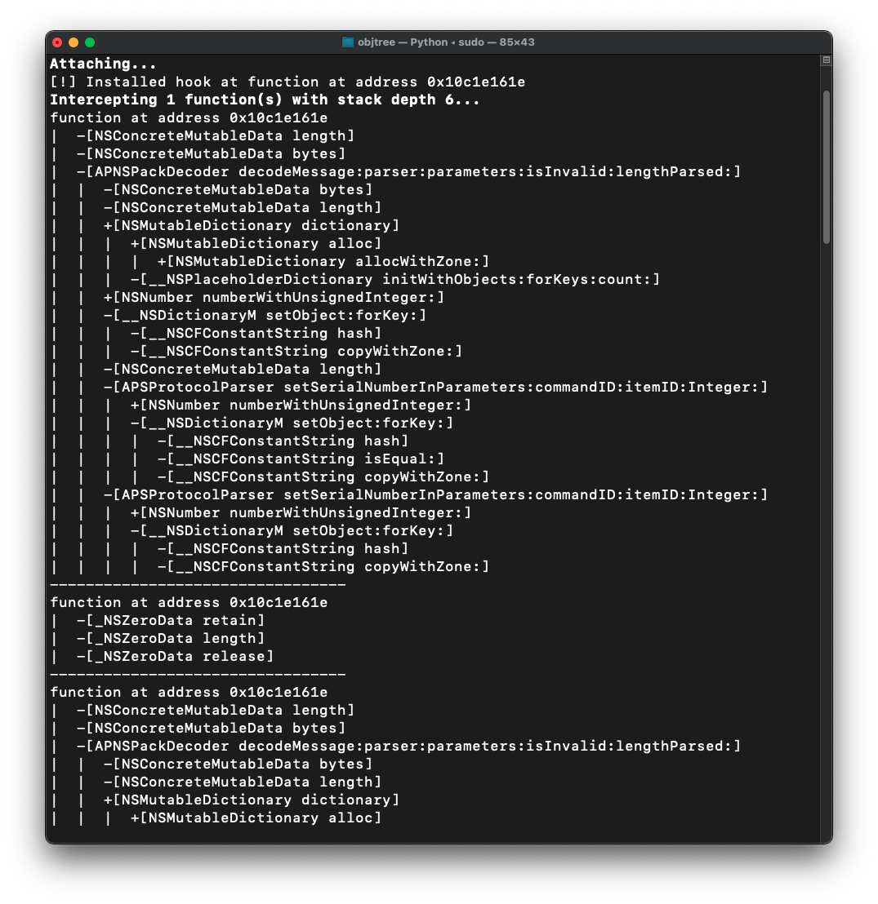

# objtree - `tree` but for Objective-C messages

## Features
* Trace all ObjC methods within the scope of a method or function (symbolicated or by relative address), `tree`-style
* Stack-depth filters
* All the `frida-trace` goodies: spawn file, attach to pid, remote frida-server, etc.

## Showcase
```
Usage: cli.py [options] target

Options:
  --version             show program's version number and exit
  -h, --help            show this help message and exit
  -D ID, --device=ID    connect to device with the given ID
  -U, --usb             connect to USB device
  -R, --remote          connect to remote frida-server
  -H HOST, --host=HOST  connect to remote frida-server on HOST
  -f FILE, --file=FILE  spawn FILE
  -F, --attach-frontmost
                        attach to frontmost application
  -n NAME, --attach-name=NAME
                        attach to NAME
  -p PID, --attach-pid=PID
                        attach to PID
  --stdio=inherit|pipe  stdio behavior when spawning (defaults to “inherit”)
  --aux=option          set aux option when spawning, such as “uid=(int)42”
                        (supported types are: string, bool, int)
  --runtime=qjs|v8      script runtime to use
  --debug               enable the Node.js compatible script debugger
  --squelch-crash       if enabled, will not dump crash report to console
  -O FILE, --options-file=FILE
                        text file containing additional command line options
  -m OBJC_METHOD        include OBJC_METHOD
  -i FUNCTION           include FUNCTION
  -a FUNCTION_OFFSET    add FUNCTION_OFFSET, relative to binary base
  -L STACK_DEPTH        trace functions up to STACK_DEPTH, default is 8
  -o OUTPUT, --output=OUTPUT
                        dump output to file OUTPUT
```


### Examples
* `objtree <some_process> -m "-[InterestingClass interestingMethod:withArg:]"`
* `objtree <some_process> -i LibFoo!bar`
* `objtree <some_process> -i generate_interesting_value -L 6`
    * Here, matches for the function name in all modules would be hooked
* `objtree <some_process> -a <offset>`
    * `offset` here would be the target method's relative offset to `some_process` base

## Note
A crash could happen under a very high volume of functions being intercepted, due to memory overload, which is very possible when working on a big binary. I tried to make the tool as lightweight as possible to avoid this. But if you face a crash, try to intercept one function at a time and adjust the stack depth filter, or intercept a function lower on the call stack. Issues are welcome as well if you think it's something non-memory related.

## Installation
`pip3 install objtree`

## License
[Apache License 2.0](LICENSE)
